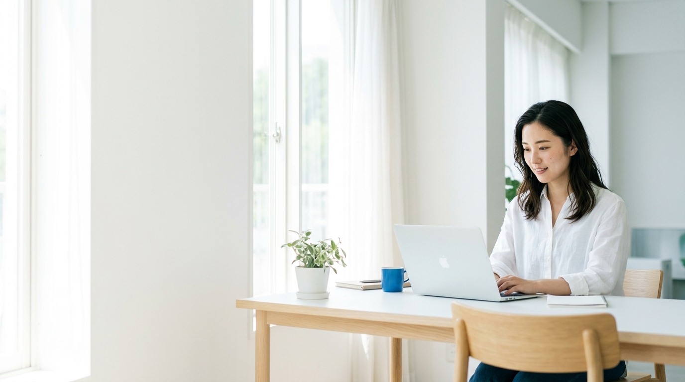
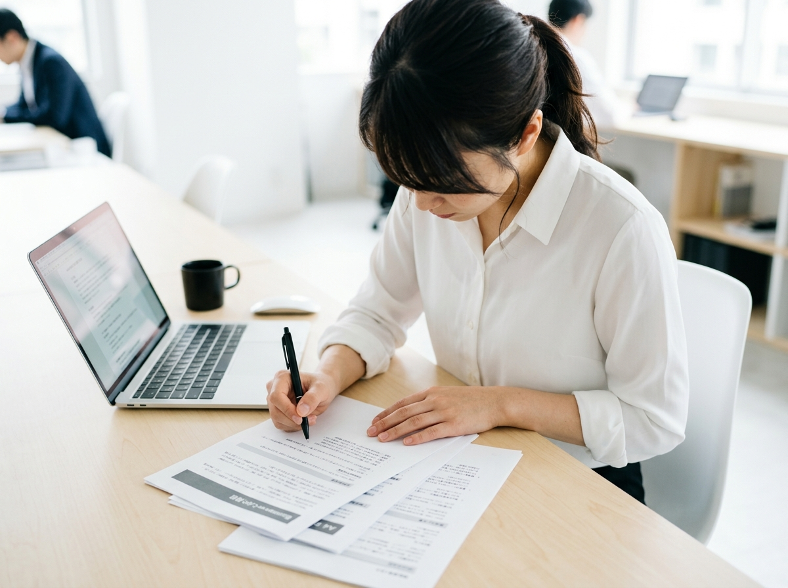
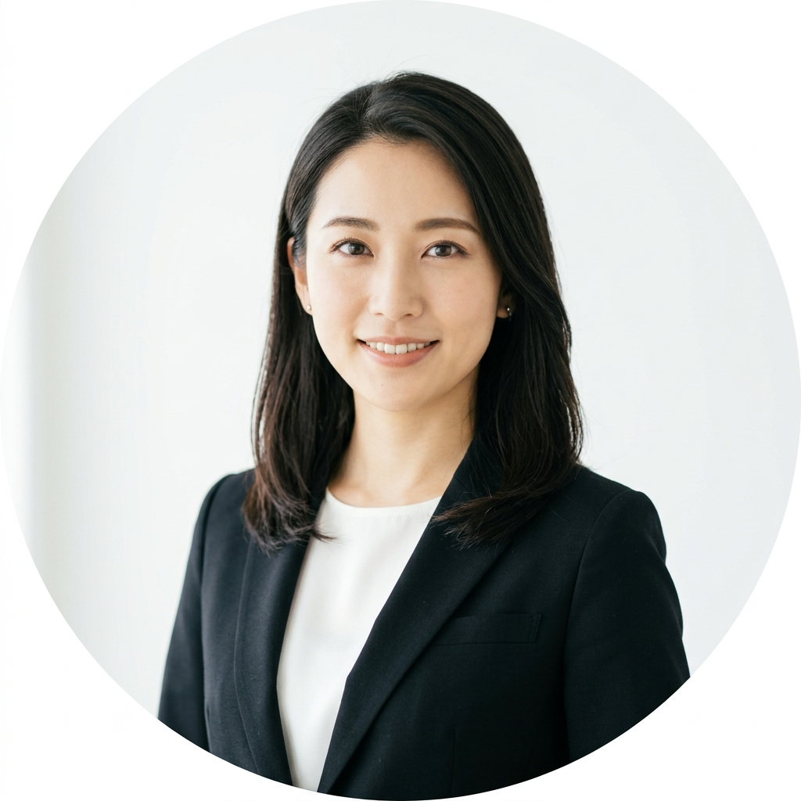

# AI Skill Lab LP｜画像生成プロンプト集

`#ccc` のプレースホルダー **全10枚** を差し替えるためのプロンプト。
Midjourney / ChatGPT画像生成 / Nano Banana / Imagen など、どのツールでも使えるように書いています。

---

## 0. 使い方（3ステップ）

1. **【共通スタイル】** と **【共通ネガティブ】** をコピーする
2. 差し替えたい画像の **【個別プロンプト】** を後ろにつなげて生成する
3. 指定サイズに書き出して `images/` フォルダへ保存 → `§6 差し替え手順` を実行

> **Midjourney を使う場合**：末尾に `--ar` を付ける（16:9 / 4:3 / 1:1）。
> ネガティブは `--no 〜` の形式に読み替えてください。
> **生成サイズのコツ**：まず指定比率の大きめサイズで生成し、書き出し時に指定ピクセルへ縮小する。
> 拡大は画質が落ちるのでNG。Retina対応するなら2倍サイズも書き出しておくと綺麗です。

---

## 1. 【共通スタイル】＝ 全プロンプトの先頭に必ず入れる

```
日本国内の、明るく清潔なオフィスまたはコワーキングスペースで撮影した実写風の写真。
大きな窓からの自然光がたっぷり入り、全体的にハイキー（明るめ）なトーン。
白・淡いグレー・淡いブルーを基調にした配色で、差し色は落ち着いたブルー（#1a6fe0前後）のみ。
彩度は控えめ、コントラストは弱め。誠実で親しみやすく、清潔感のある雰囲気。
被写体以外の情報量は抑え、余白を広くとる。浅い被写界深度で背景はやわらかくボケる。
フォトリアル、広告写真クオリティ、自然な肌の質感。画面内に文字・ロゴ・透かしは一切入れない。
```

### 登場人物の共通設定

```
20〜30代前半の日本人。モデル的に整いすぎない、自然でリアルな顔立ちと体型。
服装はオフィスカジュアル（白・ネイビー・グレー・淡いブルー・ベージュ）。
ロゴ入りの服、派手なアクセサリー、原色の服は避ける。
表情は自然で穏やか。歯を見せた誇張した作り笑いにはしない。
```

**男女比：サイト全体で女性8割・男性2割**（この集の指定どおりに作れば自動的にその比率になります）

---

## 2. 【共通ネガティブ】＝ 全プロンプトに必ず入れる

```
暗い、夜、影がつぶれている、逆光、ネオン、サイバーパンク、SF、近未来、
ホログラム、青く光る回路基板、光る脳、データの粒子、ワイヤーフレーム、
ロボット、ヒューマノイド、アンドロイド、3DCGっぽい質感、イラスト、アニメ、CG、
過度な彩度、原色、赤・オレンジ・紫・黄などの強い色面、
雑然とした背景、物が多すぎる机、観葉植物だらけ、
文字、日本語テキスト、英字テキスト、ロゴ、透かし、UIのスクリーンショット、
欧米人・その他の外国人モデル、
不自然な作り笑い、いかにもなストックフォト表現、
手指の破綻、指の本数の異常、顔の歪み
```

> ⚠️ **最重要**：「AI講座」というテーマだと、生成AIは高確率で**青く光る回路・脳・ロボット等のサイバー系ビジュアル**を出してきます。
> これを入れるとLPのテイスト（ブルー×ホワイトの清潔・誠実系）が一発で崩壊します。ネガティブは必ず入れてください。

---

## 3. 画像一覧

| No | ファイル名 | 使用箇所 | サイズ | 比率 | 人物 |
|---|---|---|---|---|---|
| 01 | `hero-01.jpg` | FVカルーセル1枚目 | 1920×1080px | 16:9 | 女性1 |
| 02 | `hero-02.jpg` | FVカルーセル2枚目 | 1920×1080px | 16:9 | 女性1 |
| 03 | `hero-03.jpg` | FVカルーセル3枚目 | 1920×1080px | 16:9 | 女性1・男性1 |
| 04 | `feature-01.jpg` | 強み01（教材はあなたの仕事） | 900×675px | 4:3 | 女性1 |
| 05 | `feature-02.jpg` | 強み02（個別サポート） | 900×675px | 4:3 | 女性2 |
| 06 | `feature-03.jpg` | 強み03（教材は常に最新） | 900×675px | 4:3 | 女性1 |
| 07 | `ceo.jpg` | 代表・早川祐子 | 600×600px | 1:1 | 女性1 |
| 08 | `voice-01.jpg` | 受講生の声 M.Sさん | 400×400px※ | 1:1 | 女性1 |
| 09 | `voice-02.jpg` | 受講生の声 K.Tさん | 400×400px※ | 1:1 | 男性1 |
| 10 | `voice-03.jpg` | 受講生の声 R.Nさん | 400×400px※ | 1:1 | 女性1 |

※ 表示は112×112pxですが、Retina対応のため400×400pxで書き出し（CSS側で縮小表示）。

---

## 4. 【個別プロンプト】

### ▼ FVカルーセル（3枚）— 構図の指定が最重要

FVは画像の上に**キャッチコピー（濃紺の文字）が乗ります**。CSSで白いグラデーションのオーバーレイ
（`.p-hero__overlay`：左端95% → 中央付近88% → 60%地点42% → 右端12%の白）をかけているため、

- **画面の左半分〜中央（左60%）は、白いベールでほぼ真っ白に飛びます**
- **画面の右側だけが、はっきり見える領域です**

したがって3枚とも共通で以下を厳守してください。

```
【構図の必須条件】
・主役の人物・被写体は、画面の右寄り（右1/3〜右半分）に配置する
・画面の左半分〜中央は、白い壁・窓からの光・机の余白など「明るく情報量の少ない面」で大きく空ける
・画面全体を通してハイキー（明るめ）に。暗い色面・濃い柄・強いコントラストを画面左側に置かない
・被写体の周囲に少し余白をとる（ゆっくり拡大するアニメーションが入るため、端ギリギリに置かない）
・3枚とも色温度・明るさ・彩度を揃える（1枚だけ暗い／黄色いとカルーセル切替時にちらつきます）
```

---

#### 01. `hero-01.jpg` — 学ぶ（1920×1080 / 16:9）

```
【共通スタイル】＋【構図の必須条件】

窓際の明るいデスクでノートパソコンに向かい、集中して学習している20代後半の日本人女性が1人。
白いシャツにライトグレーのカーディガン。髪はセミロングを軽くまとめている。
画面右寄りに斜め45度から、上半身をとらえたミディアムショット。
表情は前向きで、少し口角が上がっている。手はキーボードに置かれている。
デスクの上はノートPCとマグカップ、開いたノートのみで、ほぼ何も置かれていない。
背景は白い壁と大きな窓。窓の外は明るく飛んでいる。画面左側は白い壁と光だけの空間。

【共通ネガティブ】
--ar 16:9
```

#### 02. `hero-02.jpg` — 相談する（1920×1080 / 16:9）

```
【共通スタイル】＋【構図の必須条件】

自宅のダイニングテーブルでノートパソコンを開き、オンライン面談で画面の相手に
やわらかく笑いかけながら話している20代後半の日本人女性が1人。
淡いブルーのブラウス。片手で軽くジェスチャーをしている。
画面右寄りに、やや正面寄りの角度から上半身をとらえたミディアムショット。
生活感を抑えた、白を基調としたシンプルなインテリア。
画面左側は白い壁とやわらかい光だけの、何もない空間。

【共通ネガティブ】
--ar 16:9
```

#### 03. `hero-03.jpg` — 仕事で活きる（1920×1080 / 16:9）

```
【共通スタイル】＋【構図の必須条件】

明るいオフィスで、20代後半の日本人女性が、ノートパソコンの画面を指しながら
隣に立つ30代前半の日本人男性の同僚に説明している。2人とも自然な笑顔。
女性はネイビーのジャケットに白インナー、男性は淡いブルーのシャツ。
2人は画面の右半分に配置し、ウエストアップでとらえる。
背景は白い壁とガラスパーテーションのある、すっきりしたオフィス。
画面左側は白い壁と光だけの、何もない空間。

【共通ネガティブ】
--ar 16:9
```

---

### ▼ サービスの強み（3枚 / 900×675px / 4:3）

角丸16pxでトリミングされ、白い背景の上にやわらかい影付きで配置されます。
**被写体は中央寄り**に置き、四隅ギリギリに重要な要素を置かないでください。

#### 04. `feature-01.jpg` — 教材は「あなたの仕事」

```
【共通スタイル】

明るいオフィスのデスクで、印刷した業務資料とノートパソコンを並べ、
資料にペンで書き込みながら作業している20代後半の日本人女性の手元〜上半身。
ややハイアングルで、机の上の資料とPCが自然に入る構図。
女性は白いブラウス。顔は画面の上側に半分ほど入る程度で、手元と資料が主役。
資料の中身は文字が読めないほど自然にぼかす。机の上は必要最低限のものだけ。
背景は白い壁でやわらかくボケている。

【共通ネガティブ】
--ar 4:3
```

#### 05. `feature-02.jpg` — 個別サポート

```
【共通スタイル】

明るい室内で、ノートパソコンの画面をはさんでオンライン面談をしている場面。
手前に20代後半の日本人女性の後ろ姿（肩越し・軽くボケている）、
ノートPCの画面の中に、講師役の30代前半の日本人女性が笑顔で話している姿が映っている。
画面の中身のUIは映さず、人物だけが自然に見えるようにする。
落ち着いたネイビーと白の服装。机の上はノートPCとノートのみ。
背景は白い壁と自然光。

【共通ネガティブ】
--ar 4:3
```

#### 06. `feature-03.jpg` — 教材は常に最新版

```
【共通スタイル】

明るいカフェのカウンター席で、タブレットを両手で持って学習動画を見ている
20代後半の日本人女性。ベージュのニットに白インナー。
横〜斜め45度からのミディアムショット。穏やかな表情。
タブレットの画面は光でやわらかく飛ばし、中身は見せない。
隣に小さなマグカップ。背景は白い壁と木のカウンターでやわらかくボケている。
落ち着いた、静かで集中できる空気感。

【共通ネガティブ】
--ar 4:3
```

---

### ▼ 代表写真（1枚 / 600×600px / 1:1）

**円形にトリミングされます。** 四隅は完全に切り落とされるため、
**顔を中央に置き、頭上・左右・肩の下に十分な余白**をとってください。

#### 07. `ceo.jpg` — 代表 早川 祐子

```
【共通スタイル】

20代後半の日本人女性のビジネスポートレート。AI学習サービスの代表という設定。
黒のテーラードジャケットに白のインナー。髪は肩につく長さの黒髪セミロングで、清潔にまとめている。
メイクはナチュラル。アクセサリーは小ぶりのピアス程度。
正面からやや斜め（15度程度）のバストアップ。目線はカメラ。
表情は、誠実さと親しみやすさが同居したやわらかい微笑み。歯は見せすぎない。
背景は白〜ごく淡いグレーの無地、またはボケた明るいオフィス。
顔が正方形の中央に来るように配置し、頭上と左右に十分な余白をとる（円形に切り抜かれるため）。
自然光のような、影のやわらかいライティング。

【共通ネガティブ】
--ar 1:1
```

---

### ▼ 受講生の声（3枚 / 400×400px / 1:1）

こちらも**円形トリミング＋112pxで小さく表示**されます。
**顔が大きめに写った、明るい背景のバストアップ**にしてください。小さくても誰か分かることが優先です。

#### 08. `voice-01.jpg` — M.Sさん（26歳・女性・メーカー／営業事務）

```
【共通スタイル】

26歳くらいの日本人女性のポートレート。落ち着いた事務職の雰囲気。
淡いブルーのブラウス。黒髪のミディアムボブ。ナチュラルメイク。
正面バストアップ、目線はカメラ、自然でやわらかい微笑み。
背景は白〜淡いグレーの無地でやわらかくボケている。
顔を正方形の中央に配置し、頭上と左右に余白をとる（円形に切り抜かれるため）。

【共通ネガティブ】
--ar 1:1
```

#### 09. `voice-02.jpg` — K.Tさん（29歳・男性・IT企業／人事）

```
【共通スタイル】

29歳くらいの日本人男性のポートレート。誠実で穏やかな人事職の雰囲気。
白いシャツにネイビーのジャケット。黒髪の短髪、清潔感のある髪型。
正面バストアップ、目線はカメラ、控えめで自然な微笑み。
背景は白〜淡いグレーの無地でやわらかくボケている。
顔を正方形の中央に配置し、頭上と左右に余白をとる（円形に切り抜かれるため）。

【共通ネガティブ】
--ar 1:1
```

#### 10. `voice-03.jpg` — R.Nさん（24歳・女性・広告代理店／制作）

```
【共通スタイル】

24歳くらいの日本人女性のポートレート。クリエイティブ職らしい、少し軽やかな雰囲気。
白のシャツにライトグレーのカーディガン。黒髪のロングヘアを片側に流している。
正面よりやや斜めのバストアップ、目線はカメラ、明るく自然な笑顔。
背景は白〜淡いグレーの無地でやわらかくボケている。
顔を正方形の中央に配置し、頭上と左右に余白をとる（円形に切り抜かれるため）。

【共通ネガティブ】
--ar 1:1
```

---

## 5. 生成後チェックリスト

サイトに載せる前に、この6つを必ず確認してください。

- [ ] **FV3枚：主役が画面右寄りにあるか**（左に人物が来ていると白ベールで消えます）
- [ ] **FV3枚：画面左半分が明るく、余計なものが写っていないか**
- [ ] **FV3枚：3枚の明るさ・色味が揃っているか**（並べて見比べる。ちらつき防止）
- [ ] **FV3枚：SP表示では画像全面に白ベールがかかる**ため、暗い画像が混ざっていないか
- [ ] **円形4枚：正方形の中央に顔があり、円で切っても頭・あごが欠けないか**
- [ ] **全枚：文字・ロゴ・サイバー系の光る演出が写り込んでいないか**
- [ ] **全枚：指定ピクセルちょうどで書き出したか**（比率がずれると表示が伸び縮みします）

### もし暗い／濃い画像を使いたくなったら

CSS側の調整が必要です。`style/style.css` の `.p-hero__overlay` の白グラデーションの数値を上げるか、
`.p-hero__title` `.p-hero__lead` の文字色を白系に変更してください。
**画像だけ差し替えて文字色そのままだと、キャッチコピーが読めなくなります。**

---

## 6. 差し替え手順

### ① フォルダ構成

```
lp-project/
├── index.html
├── images/          ← 新規作成
│   ├── hero-01.jpg 〜 hero-03.jpg
│   ├── feature-01.jpg 〜 feature-03.jpg
│   ├── ceo.jpg
│   └── voice-01.jpg 〜 voice-03.jpg
└── style/
```

### ② HTMLの書き換え例

**FVカルーセル**（`<div class="c-ph">…</div>` を丸ごと置き換え）

```html
<div class="p-hero__slide">
  
</div>
```

**サービスの強み**

```html
<div class="p-feature__visual">
  
</div>
```

**代表写真・受講生の声**

```html

```

### ③ style.css の末尾に追記

```css
/* --- 実画像用 --- */
.p-hero__img {
  width: 100%;
  height: 100%;
  object-fit: cover;
}

.c-img {
  width: 100%;
  border-radius: var(--radius);
  box-shadow: var(--shadow);
}

.c-img--circle {
  border-radius: 50%;
  box-shadow: none;
  aspect-ratio: 1 / 1;
  object-fit: cover;
}
```

> `alt` 属性は装飾目的のFV画像は空（`alt=""`）、内容を伝える画像は日本語で内容を書く。
> `loading="lazy"` はFV画像には付けない（初期表示が遅れるため）。

---

## 補足

- 代表名の正式表記は **早川 祐子**（「優子」ではありません）。`index.html` および本ファイル内も祐子で統一済みです。
- 受講生の声3枚は、実在しない人物のイメージ写真です。実案件で使う場合は「※写真はイメージです」の注記を入れるか、実際の受講生の写真に差し替えてください。
