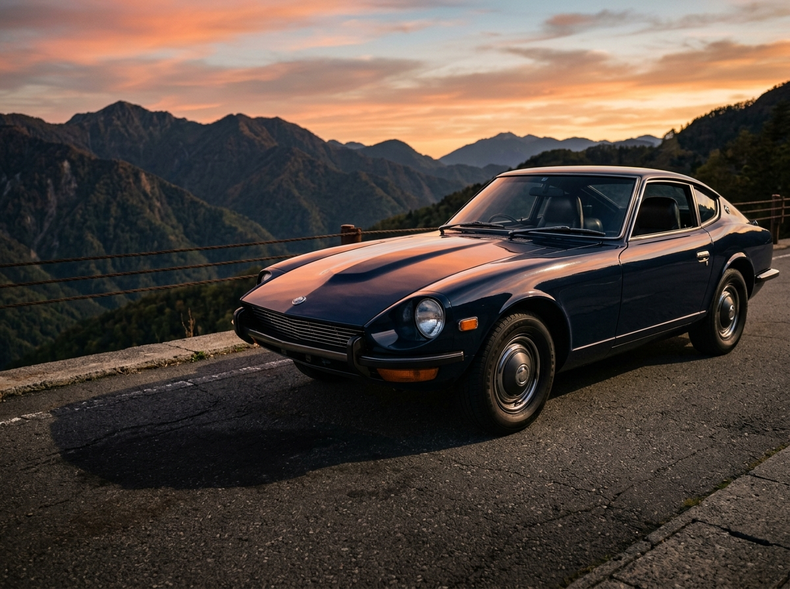

# SHUTTER GARAGE — 画像生成プロンプト集

`#ccc` のプレースホルダー全12箇所を埋めるためのプロンプト。
上から順に生成して差し替えれば、HTMLの構造を一切変えずに完成する。

---

## 0. 使い方

1. 「共通スタイル」を毎回プロンプトの末尾に貼り付ける
2. 各画像の個別プロンプトと組み合わせて生成する
3. **アスペクト比は必ず指定どおりに生成する**（後からトリミングして合わせない）
4. 生成した画像を `images/` フォルダに指定ファイル名で保存する
5. HTMLの `<div class="ph ph--○○">...</div>` を `` に差し替える（差し替え方法は末尾に記載）

---

## 1. 共通スタイル（全画像の末尾に必ず付ける）

```
【共通スタイル指定】
・実写のプロフェッショナル自動車写真。CG・イラスト・アニメ調は不可
・シネマティックで陰影の深いライティング。ハイライトは白飛びさせず、シャドウは締める
・彩度は控えめ。落ち着いたトーンで、原色の派手さを出さない
・構図はシンプルで余白を活かす。被写体は画面内に余裕をもって収める
・車体に撮影者・機材・不要な物体が映り込んでいないこと
・実在する自動車メーカーのエンブレム、ロゴ、車名バッジ、ナンバープレートの文字は判別できないようにする
・画面内に文字・ロゴ・ウォーターマーク・透かしを一切入れない
・日本国内のロケーションとして自然な風景であること（標識・建物・植生・路面）
・白背景のミニマルなWebサイトに掲載する前提で、上品で高級感のある仕上がりにする

【ネガティブ（避けるもの）】
文字, ロゴ, ウォーターマーク, 手描き, イラスト, CG感, 過度なHDR, 派手なレンズフレア,
過剰な彩度, 人物の指や顔の破綻, 車体の歪み, ホイールの変形, 背景の看板文字, 英語の標識
```

---

## 2. 個別プロンプト

### ① ヒーロー画像（縦位置）

- **サイズ / 比率**：900 × 1200 px（**3:4 縦**）
- **設置場所**：ファーストビュー右側
- **ファイル名**：`images/hero.jpg`

```
夕暮れの峠道に停まる1台のスポーツカーを、縦位置で撮影した写真。
日没直前の低い斜光が車体側面をなめるように当たり、ボディのキャラクターラインが
くっきりと浮かび上がっている。背景は山の稜線とグラデーションした空。
車体は画面のやや下寄りに配置し、上部に空の余白を大きく取る。
ローアングルから車体全体を斜め前方から捉える。
```

---

### ② フルワイド帯（横長・帯状）

- **サイズ / 比率**：2000 × 900 px（**20:9 超横長**）
- **設置場所**：ファーストビュー直下の全幅バンド
- **ファイル名**：`images/band.jpg`

```
六甲山の展望ロードに停まる1台のクーペを、真横やや後方から捉えた超横長の写真。
日没18分前の橙色の光が車体後半を照らし、前半は影に沈んでいる。
背景は遠くの山並みと、うっすら見える街の光。
車体は画面中央よりやや右に配置し、左側に路面と空の余白を大きく残す。
アスファルトの質感がしっかり写り込んでいる。
```

> ※画像の左下に黒いラベルが重なるため、**左下1/4には重要な要素を置かない**こと。

---

### ③ 代表者ポートレート（縦位置・人物）

- **サイズ / 比率**：900 × 1200 px（**3:4 縦**）
- **設置場所**：「その悔しさは、私自身の後悔でもあります。」セクション左
- **ファイル名**：`images/portrait.jpg`

```
50代の日本人男性フォトグラファーのポートレート写真、縦位置。
short dark hair with some grey, Japanese man in his 50s.
黒い薄手のジャケットを着て、一眼レフカメラを片手に提げている。
薄暮のガレージ入口に立ち、外光が斜めから顔の片側を照らしている。
穏やかで落ち着いた表情。カメラ目線ではなく、やや斜め方向を見ている。
背景のガレージ内部は暗く落として、人物のシルエットを浮かび上がらせる。
上半身のミディアムショット。
```

> ※必ず**日本人男性**として生成すること。欧米系の人物にならないよう注意。

---

### ④ ベネフィット1（横位置）

- **サイズ / 比率**：1200 × 800 px（**3:2 横**）
- **設置場所**：「部屋に飾れる、一枚になる」
- **ファイル名**：`images/benefit-01.jpg`

```
落ち着いた内装の日本の住宅リビングの壁に、大きな額装写真が1枚飾られている室内写真。
額の中身は暗いトーンの車の写真。壁は白、床は木目。
自然光が横から差し込み、額のガラス面にやわらかい反射が出ている。
壁と額を斜め45度から捉え、周囲に余白を大きく取る。生活感は最小限に抑える。
```

---

### ⑤ ベネフィット2（横位置）

- **サイズ / 比率**：1200 × 800 px（**3:2 横**）
- **設置場所**：「SNSでの反応が変わる」
- **ファイル名**：`images/benefit-02.jpg`

```
暗い木製デスクの上に置かれたスマートフォンを、真上からやや斜めに撮影した写真。
画面には暗いトーンの車の写真が縦位置で表示されている（画面内に文字やUIは入れない）。
デスクにはカメラのレンズキャップとメモ帳が少しだけ置かれている。
1灯の柔らかい光が斜め上から当たり、机上に長い影が落ちている。
余白を大きく取った静物写真。
```

---

### ⑥ ベネフィット3（横位置）

- **サイズ / 比率**：1200 × 800 px（**3:2 横**）
- **設置場所**：「『あの時』を、確かな形で残せる」
- **ファイル名**：`images/benefit-03.jpg`

```
夜のガレージの中で、シャッターが半分開いた状態の1台の車を撮影した写真。
外の街灯の光がシャッターの隙間から差し込み、車体のフロント部分だけを照らしている。
車体後方は闇に沈んでいる。人物は写っていない。
正面やや斜めからのアングル。静けさと余韻のある構図。
```

---

### ⑦〜⑫ 撮影実績ギャラリー（横位置・6点）

- **サイズ / 比率**：すべて 1000 × 750 px（**4:3 横**）
- **設置場所**：Works セクションのグリッド
- **ファイル名**：`images/work-01.jpg` 〜 `images/work-06.jpg`

> ※各画像の**左下に黒いラベル**が重なるため、左下に重要な要素を置かないこと。
> ※6点を並べたときに単調にならないよう、**車種・色・時間帯・アングルを意図的にばらけさせている**。

#### ⑦ work-01.jpg ｜ 六甲山 / 兵庫 · 日没18分前

```
山道の展望スペースに停まる濃紺の国産旧車クーペを、斜め前方から捉えた写真。
日没直前の橙色の斜光がボンネットとフロントフェンダーを照らし、路面に長い影が伸びている。
背景は山並みと夕空。ローアングル。
```

#### ⑧ work-02.jpg ｜ 大阪港 倉庫街 · 日没後32分

```
夜の倉庫街の前に停まる白いスーパーカーを、真後ろやや斜めから捉えた写真。
ブルーアワーの深い青の空と、倉庫のオレンジ色のナトリウム灯が対比になっている。
濡れたアスファルトに車体と灯りが反射している。アイレベルの構図。
```

#### ⑨ work-03.jpg ｜ 京北 山間路 / 京都 · 早朝5:40

```
朝もやの立ち込める山間の細い道に停まる、シルバーのセダンを撮影した写真。
早朝の淡い光が霧を透かし、杉林のシルエットが背景に重なっている。
彩度の低い、静かで冷たいトーン。車体を横位置に配置した引きの構図。
```

#### ⑩ work-04.jpg ｜ ご自宅ガレージ / 奈良 · 灯体使用

```
夜の個人ガレージの中で、照明機材を使って撮影された黒いスポーツカーの写真。
上方からの柔らかい光がルーフとボディサイドの曲面を舐め、
黒い塗装の中に立体的なハイライトのラインが浮かんでいる。
背景のガレージ壁面は暗く落とす。斜め前方からのローアングル。
```

#### ⑪ work-05.jpg ｜ 琵琶湖 湖岸 / 滋賀 · 日没12分前

```
湖のほとりの舗装路に停まる赤いオープンカーを、後方斜めから捉えた写真。
日没直前の光が湖面に反射してきらめき、車体の赤が沈んだトーンで発色している。
背景は水平線と穏やかな湖面。ゆったりとした引きの構図。
```

#### ⑫ work-06.jpg ｜ 出品用 車両記録 / 大阪 · 曇天 拡散光

```
曇り空の下、無地のコンクリート壁の前に停められた白いセダンを、
真横から水平・平行に捉えた記録写真。
曇天の拡散光で影が出ておらず、車体全体が均一に明るく写っている。
背景は無地のコンクリートのみ。車両状態が正確に伝わる、資料的で端正な構図。
```

---

## 3. 差し替え方法（HTML構造は変えないこと）

各プレースホルダーの `<div class="ph ph--○○">...</div>` を、
**同じクラス名を維持したまま** `` に置き換える。

```html
<!-- 変更前 -->
<div class="ph ph--work"><span class="ph__label">Work 01<br>1000 × 750</span></div>

<!-- 変更後 -->

```

差し替え後、`style.css` に以下を追記する（`.ph` に `object-fit` を効かせるため）。

```css
img.ph { object-fit: cover; }
```

**変えてはいけないもの**
- 親要素（`.hero__media` / `.band` / `.duo__media` / `.work`）の構造
- `.chip`（写真の上に載る黒いラベル）の位置と記述
- セクションの並び順、クラス名

---

## 4. 生成後のチェックリスト

- [ ] 12枚すべて、指定のアスペクト比どおりに生成できているか
- [ ] 正方形や別比率のまま貼り込んでいないか
- [ ] 人物画像は日本人男性（50代）になっているか
- [ ] 車体にメーカーロゴ・ナンバーの文字が読み取れる形で写っていないか
- [ ] 画像内に文字・ウォーターマークが入っていないか
- [ ] 6枚のギャラリーが、色・時間帯・アングルでばらけて見えるか
- [ ] 左下にラベルが載る画像（②⑦〜⑫）で、左下に重要な要素がないか
- [ ] 全体を通して彩度・明度のトーンが揃っているか
