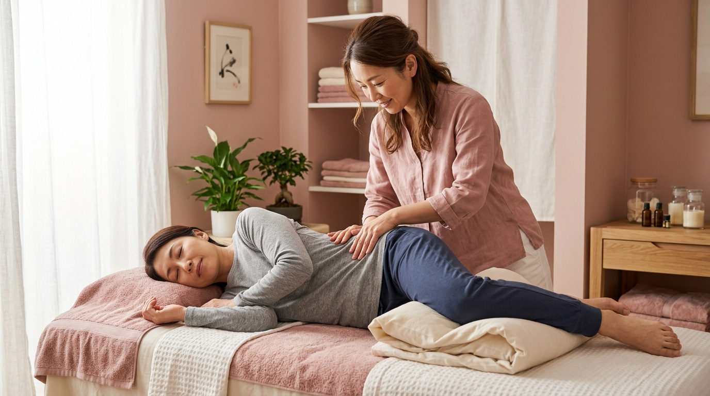

# 画像生成プロンプト｜整体サロン「Éclore（エクロール）」LP

このLPの `#ccc` プレースホルダー（全20枚）を、実際の画像に差し替えるための指示書です。
**上から順に画像を生成し、各プレースホルダーと同じ比率・同じ役割で当てはめてください。**

---

## ★ 絶対に守るルール（重要）

1. **プレースホルダーと同じ縦横比で生成する**
   長方形の枠に正方形画像などを入れると崩れます。各画像に指定した「比率・推奨px」を必ず守ること。

2. **人物は必ず日本人（アジア系）を使用する**
   モデルは日本人。特に40代の女性がメインターゲットなので、年代感も合わせること。

3. **サイトのデザインから大きく外れる画像を作らない**
   世界観は「上品ガーリー × くすみピンク」。以下を全画像共通のトーンにすること。
   - 色味：くすみピンク／ベージュ／アイボリー／オフホワイト基調の淡いトーン
   - 明るさ：高明度・低彩度、やわらかい自然光、ふんわりした空気感
   - 避ける：原色・ビビッド、暗い/濃い影、ゴテゴテした装飾、男性的・クリニック的な硬さ

4. **HTMLの構成は触らない**
   セクションや構造は一切変更しない。既存の `<div class="placeholder ...">` に画像を当てはめるだけ。
   （実装方法は末尾「■ 画像の入れ方」を参照）

5. **共通の画質指定**
   `high quality, photorealistic, soft natural light, shallow depth of field, pastel dusty pink and beige tones, clean and airy, elegant, Japanese`

6. **共通のネガティブ（除外）**
   `text, watermark, logo, deformed hands, extra fingers, low quality, oversaturated, dark, harsh shadow, western/caucasian model, cluttered, medical/clinical look`

---

## ■ 画像リスト（上から順に対応）

### ① ファーストビュー背景（3枚・フェード切替）
横長のフルスクリーン背景。**左側に文字が乗る**ので、左半分は明るくシンプルに（人物や要素は右寄りが理想）。

| No | ラベル | 比率 | 推奨px | 種類 |
|----|--------|------|--------|------|
| 1 | FV写真1（施術風景） | 16:9 | 1920×1080 | 写真 |
| 2 | FV写真2（笑顔の40代女性） | 16:9 | 1920×1080 | 写真 |
| 3 | FV写真3（院内の雰囲気） | 16:9 | 1920×1080 | 写真 |

- **No.1**：`A Japanese woman in her 40s receiving a gentle relaxing body treatment at a bright private salon, soft dusty pink interior, calm and elegant, natural window light, subject on the right side, bright empty space on the left`
- **No.2**：`A smiling healthy Japanese woman in her 40s, natural makeup, soft beige knitwear, bright airy background, warm and confident, positioned on the right, soft pink pastel tones`
- **No.3**：`Interior of a clean elegant private women's therapy salon, dusty pink and ivory tones, treatment bed, plants and soft decor, bright morning light, no people`

---

### ② お悩みイメージ（1枚）
| No | ラベル | 比率 | 推奨px | 種類 |
|----|--------|------|--------|------|
| 4 | 悩む40代女性のイメージ | **3:4（縦長）** | 900×1200 | 写真 |

`A Japanese woman in her 40s looking at her body/posture in a mirror with a slightly worried expression, soft home interior, natural light, dusty pink tones, gentle and relatable mood, vertical portrait`

---

### ③ 代表の写真（1枚・丸くマスクされます）
| No | ラベル | 比率 | 推奨px | 種類 |
|----|--------|------|--------|------|
| 5 | 代表・谷口由真の写真 | **1:1（正方形）** | 800×800 | 写真 |

`Portrait of a warm and trustworthy Japanese woman in her 40s, therapist / salon owner, natural makeup, gentle smile, soft beige clothing, bright clean background, centered composition with margin around the face`
※ 円形に切り抜かれるため、**顔は中央・周囲に余白**を持たせること。

---

### ④ 施術・解決策の写真（3枚・横長）
| No | ラベル | 比率 | 推奨px | 種類 |
|----|--------|------|--------|------|
| 6 | 骨盤矯正の施術風景 | **16:10** | 1000×625 | 写真 |
| 7 | 姿勢ビフォーアフター | **16:10** | 1000×625 | 写真 |
| 8 | 女性専用のプライベート空間 | **16:10** | 1000×625 | 写真 |

- **No.6**：`A female Japanese therapist gently performing pelvic adjustment on a Japanese woman in her 40s lying on a treatment bed, soft and painless, bright private salon, dusty pink tones`
- **No.7**：`Side profile of a Japanese woman in her 40s showing beautiful improved posture, elegant standing pose, soft studio background in pastel beige, graceful and refined`
- **No.8**：`A cozy private women-only salon room, single treatment bed with clean linens, soft pink and ivory decor, plants, warm indirect light, no people`

---

### ⑤ ベネフィットのイラスト（4枚・丸型）
**写真ではなく、上品な線画／フラットイラスト**で統一。くすみピンク＆ゴールドの細い線、白背景。
| No | ラベル | 比率 | 推奨px | 種類 |
|----|--------|------|--------|------|
| 9 | イラスト（鏡を見るのが楽しくなる） | **1:1** | 500×500 | イラスト |
| 10 | イラスト（昔の服がまた着られる） | **1:1** | 500×500 | イラスト |
| 11 | イラスト（姿勢を褒められる） | **1:1** | 500×500 | イラスト |
| 12 | イラスト（体が軽く前向きに） | **1:1** | 500×500 | イラスト |

共通スタイル：`minimal elegant line illustration, thin dusty pink and gold lines, flat, white background, delicate feminine style, centered`
- No.9：`a woman happily looking into a hand mirror`
- No.10：`a stylish dress on a hanger`
- No.11：`a woman standing with beautiful straight posture`
- No.12：`a woman stretching lightly, feeling light and refreshed`
※ 人物を描く場合は日本人（黒髪）を想起させる表現に。

---

### ⑥ お客様の声（3枚・丸型）
| No | ラベル | 比率 | 推奨px | 種類 |
|----|--------|------|--------|------|
| 13 | お客様写真1（45歳・会社員） | **1:1** | 500×500 | 写真 |
| 14 | お客様写真2（48歳・主婦） | **1:1** | 500×500 | 写真 |
| 15 | お客様写真3（42歳・パート） | **1:1** | 500×500 | 写真 |

`Natural friendly headshot of a Japanese woman (No.13: age 45 / No.14: age 48 / No.15: age 42), soft smile, natural makeup, bright clean background, pastel tones, centered face with margin`
※ 円形マスクのため顔は中央・周囲に余白。3人が別人になるよう髪型・服装を少しずつ変える。

---

### ⑦ ご利用の流れ アイコン（5枚・丸型）
ベネフィットと同じ**上品な線画／フラットイラスト**（くすみピンク＆ゴールド、白背景）で統一。
| No | ラベル | 比率 | 推奨px | 種類 |
|----|--------|------|--------|------|
| 16 | 予約 | **1:1** | 500×500 | アイコン風イラスト |
| 17 | カウンセリング | **1:1** | 500×500 | アイコン風イラスト |
| 18 | 体の状態チェック | **1:1** | 500×500 | アイコン風イラスト |
| 19 | 施術 | **1:1** | 500×500 | アイコン風イラスト |
| 20 | アフターケア | **1:1** | 500×500 | アイコン風イラスト |

共通スタイル：`minimal line icon illustration, thin dusty pink and gold lines, flat, white background, simple and elegant`
- No.16：`smartphone / calendar reservation`
- No.17：`two people talking, counseling`
- No.18：`checking body posture / clipboard`
- No.19：`gentle hands performing massage`
- No.20：`woman doing light self-care stretch at home`

---

## ■ 画像の入れ方（HTML構造は変えない）

各プレースホルダーに、生成画像を**背景として流し込む**のが最も安全です（枠サイズを保ったまま、はみ出しは自動でトリミングされ崩れません）。

### 手順
1. 画像を `images/` フォルダに、上の No 順で分かりやすく保存（例：`01_fv1.jpg`, `04_nayami.jpg`, `05_daihyo.jpg` …）。
2. 各 `<div class="placeholder ...">` に画像を割り当てる。方法は次のどちらか。

**方法A（推奨・CSSで背景指定）** — `placeholder` の中身を消さず、背景画像を足すだけ：
```html
<div class="placeholder" data-label="骨盤矯正の施術風景"
     style="background-image:url('images/06_koban.jpg'); background-size:cover; background-position:center;"></div>
```
※ `background-size:cover` により、比率が多少ずれても**歪まず**枠にフィットします。

**方法B（imgタグを入れる）** — プレースホルダーの中に画像を入れる：
```html
<div class="placeholder" data-label="骨盤矯正の施術風景">
  
</div>
```

### 注意
- `background-size:cover` または `object-fit:cover` を**必ず**付けること。これが崩れ防止の肝です。
- `class` は消さない・変えない（`placeholder--circle` などがサイズ・丸型を決めています）。
- 丸型（circle）の画像は、顔・主役が**中央**に来るように生成しておくと、切り抜きで欠けません。
- ダミーラベルを消したい場合は、CSSの `.placeholder::after { content: attr(data-label); }` の行を削除すればOK（構造は変わりません）。

---

## ■ 生成枚数まとめ
- 写真：11枚（FV3＋お悩み1＋代表1＋施術3＋お客様3）
- イラスト：9枚（ベネフィット4＋流れ5）
- **合計20枚**（地図はGoogleマップ埋め込みのため生成不要）
