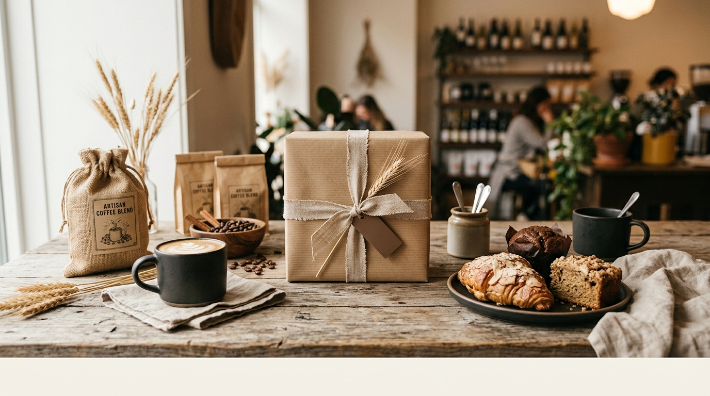
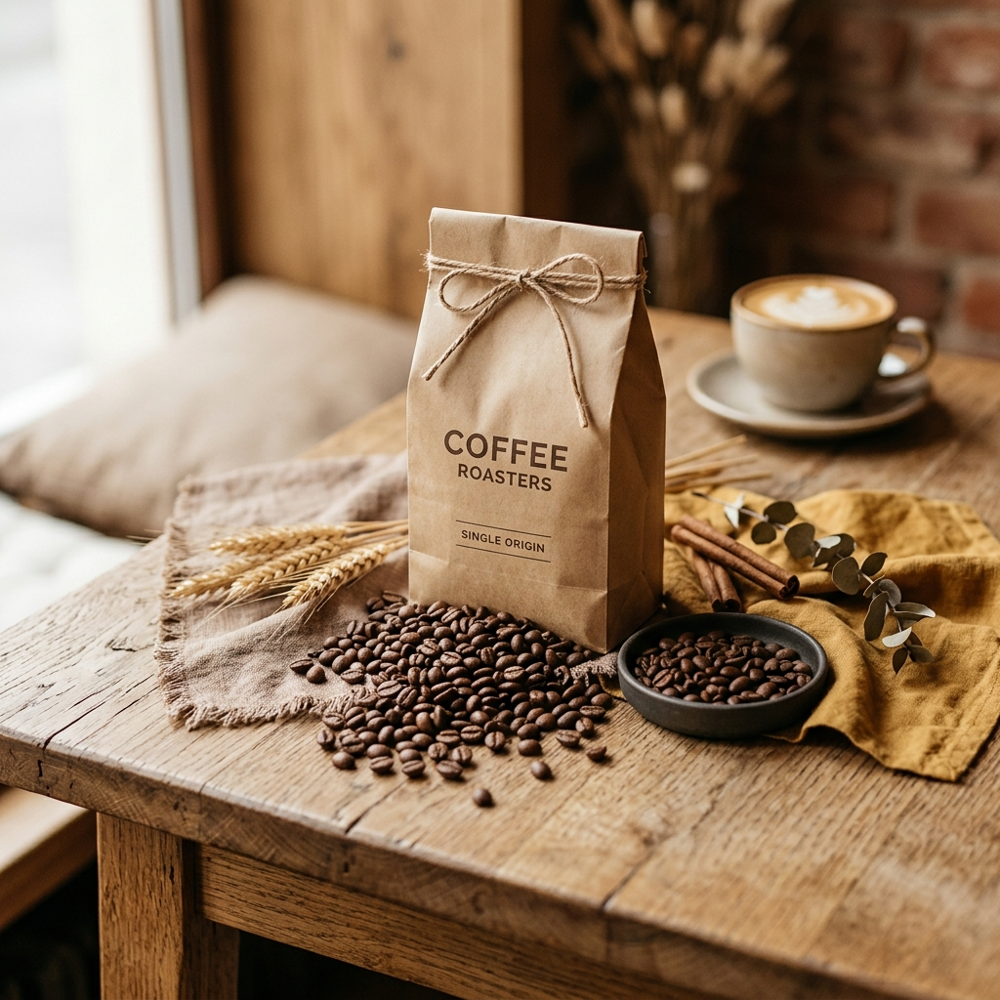
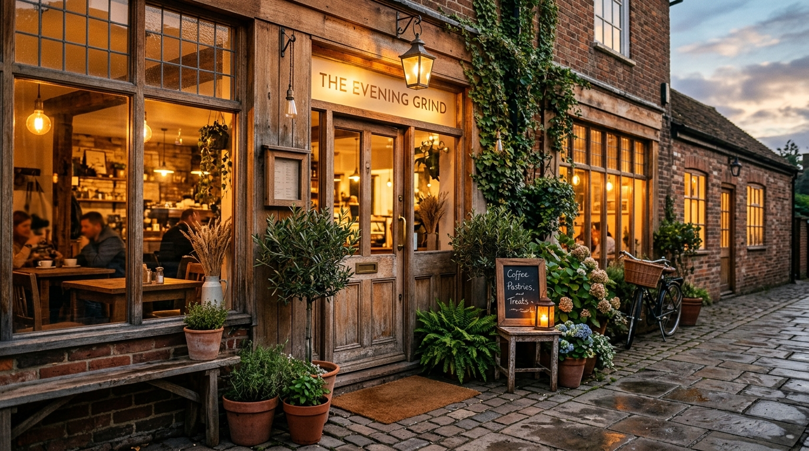

# Café Cocoro｜画像作成バッチ指示書（image-create.md）

このファイルは **Google Antigravity（エージェント型IDE）** に丸ごと渡して、
**Nano Banana 2** モデルで画像を一括生成するための指示書です。

---

## エージェントへの実行指示（Instructions for the agent）

- 下の各項目について、**Nano Banana 2** で画像を1枚ずつ生成してください。
- 各項目の **Filename**（例：`hero_pancake.jpg`）を**そのままのファイル名**で `./images/` に保存してください。
- 各項目の **Aspect ratio**（16:9 / 21:9 / 4:3 / 3:2 / 1:1）を必ず指定通りに設定してください。
- プロンプト本文（```内）はそのまま使ってください。文字・ロゴ・透かし・人物の顔は入れないこと。
- **1:1 の画像は円形に切り抜かれる**ため、被写体を中央に置き四隅に余白を確保すること（各プロンプトに指定済み）。
- 生成対象は **合計 43 枚**。この指示書に載っている Filename が全リストです。
- 出力先フォルダ：`./images/`（無ければ作成）。

---

## 共通スタイルアンカー（全プロンプトの冒頭に含めてあります）

> Natural-light café food photography, warm earthy palette of cream, beige and mocha brown with a soft mustard accent, rustic wooden table, matte dark stoneware, linen textures, subtle natural props such as cinnamon sticks, coffee beans and dried wheat, soft shadows, shallow depth of field, cozy editorial café-magazine mood, feminine and mouth-watering, no text, no logo, no watermark, no faces.

---

# ① index.html（TOP）

### hero_pancake.jpg ｜ Aspect ratio 16:9
```
Natural-light café food photography, warm earthy palette of cream, beige and mocha brown with a soft mustard accent, rustic wooden table, matte dark stoneware, linen textures, subtle natural props such as cinnamon sticks, coffee beans and dried wheat, soft shadows, shallow depth of field, cozy editorial café-magazine mood, feminine and mouth-watering, no text, no logo, no watermark, no faces. A tall stack of fluffy Japanese soufflé pancakes on a matte dark ceramic plate, dusted with powdered sugar, melting butter and a slow drizzle of maple syrup, fresh berries on the side, gentle steam. Soft window light from the left. Aspect ratio 16:9, key subject centered with generous breathing room.
```
**訳:** ふわしゅわパンケーキの高い重ね、粉糖・バター・メープル・ベリー・湯気、左からの窓光。16:9・中央・余白たっぷり。

### hero_lunch.jpg ｜ Aspect ratio 16:9
```
Natural-light café food photography, warm earthy palette of cream, beige and mocha brown with a soft mustard accent, rustic wooden table, matte dark stoneware, linen textures, subtle natural props such as cinnamon sticks, coffee beans and dried wheat, soft shadows, shallow depth of field, cozy editorial café-magazine mood, feminine and mouth-watering, no text, no logo, no watermark, no faces. A seasonal deli lunch plate with colorful roasted vegetables, a small salad, quiche and a cup of soup, arranged beautifully on a matte stoneware plate. Bright airy daylight. Aspect ratio 16:9, key subject centered with generous breathing room.
```
**訳:** 彩り野菜・サラダ・キッシュ・スープの季節のデリランチプレート、明るい昼光。16:9・中央・余白たっぷり。

### hero_coffee.jpg ｜ Aspect ratio 16:9
```
Natural-light café food photography, warm earthy palette of cream, beige and mocha brown with a soft mustard accent, rustic wooden table, matte dark stoneware, linen textures, subtle natural props such as cinnamon sticks, coffee beans and dried wheat, soft shadows, shallow depth of field, cozy editorial café-magazine mood, feminine and mouth-watering, no text, no logo, no watermark, no faces. A cup of latte with delicate latte art beside a slice of baked cheesecake on a small plate, a woman's hands gently resting near the cup. Warm afternoon light. Aspect ratio 16:9, key subject centered with generous breathing room.
```
**訳:** ラテアートのカフェラテと小皿のチーズケーキ、カップのそばに女性の手、午後の光。16:9・中央・余白たっぷり。

### interior_main.jpg ｜ Aspect ratio 4:3 ｜🔁 about③でも使用
```
Natural-light café food photography, warm earthy palette of cream, beige and mocha brown with a soft mustard accent, rustic wooden table, matte dark stoneware, linen textures, subtle natural props such as cinnamon sticks, coffee beans and dried wheat, soft shadows, shallow depth of field, cozy editorial café-magazine mood, feminine and mouth-watering, no text, no logo, no watermark, no faces. Cozy café interior with warm wooden tables and chairs, soft pendant lighting, potted greenery by a large window, calm and inviting atmosphere. Aspect ratio 4:3, balanced composition.
```
**訳:** 木のテーブルと椅子、柔らかい照明、窓辺のグリーンの居心地よい店内。4:3・バランス構図。

### pancake_classic.jpg ｜ Aspect ratio 1:1 ｜🔁 menuでも使用
```
Natural-light café food photography, warm earthy palette of cream, beige and mocha brown with a soft mustard accent, rustic wooden table, matte dark stoneware, linen textures, subtle natural props such as cinnamon sticks, coffee beans and dried wheat, soft shadows, shallow depth of field, cozy editorial café-magazine mood, feminine and mouth-watering, no text, no logo, no watermark, no faces. Fluffy soufflé pancakes with a swirl of whipped cream and maple syrup, slight overhead angle, plate centered. Aspect ratio 1:1, subject perfectly centered with even margins (safe for circular crop).
```
**訳:** ホイップとメープルのふわしゅわパンケーキ、やや俯瞰・中央。1:1・中央・均等余白（円形対応）。

### lunch_deli.jpg ｜ Aspect ratio 1:1 ｜🔁 menuでも使用
```
Natural-light café food photography, warm earthy palette of cream, beige and mocha brown with a soft mustard accent, rustic wooden table, matte dark stoneware, linen textures, subtle natural props such as cinnamon sticks, coffee beans and dried wheat, soft shadows, shallow depth of field, cozy editorial café-magazine mood, feminine and mouth-watering, no text, no logo, no watermark, no faces. A deli plate with three colorful vegetable side dishes, soup and bread, slight overhead angle, plate centered. Aspect ratio 1:1, subject perfectly centered with even margins (safe for circular crop).
```
**訳:** 彩り野菜デリ3種・スープ・パンのプレート、やや俯瞰・中央。1:1・中央・均等余白（円形対応）。

### sweets_cheesecake.jpg ｜ Aspect ratio 1:1 ｜🔁 menuでも使用
```
Natural-light café food photography, warm earthy palette of cream, beige and mocha brown with a soft mustard accent, rustic wooden table, matte dark stoneware, linen textures, subtle natural props such as cinnamon sticks, coffee beans and dried wheat, soft shadows, shallow depth of field, cozy editorial café-magazine mood, feminine and mouth-watering, no text, no logo, no watermark, no faces. A creamy baked cheesecake slice, smooth and golden, on a matte plate, slight overhead angle, centered. Aspect ratio 1:1, subject perfectly centered with even margins (safe for circular crop).
```
**訳:** なめらか濃厚ベイクドチーズケーキ一切れ、やや俯瞰・中央。1:1・中央・均等余白（円形対応）。

### drink_coffee.jpg ｜ Aspect ratio 1:1 ｜🔁 menuでも使用
```
Natural-light café food photography, warm earthy palette of cream, beige and mocha brown with a soft mustard accent, rustic wooden table, matte dark stoneware, linen textures, subtle natural props such as cinnamon sticks, coffee beans and dried wheat, soft shadows, shallow depth of field, cozy editorial café-magazine mood, feminine and mouth-watering, no text, no logo, no watermark, no faces. A cup of freshly brewed coffee with rich crema on a saucer, roasted beans nearby, centered. Aspect ratio 1:1, subject perfectly centered with even margins (safe for circular crop).
```
**訳:** クレマ豊かな淹れたてコーヒー、脇に焙煎豆、中央。1:1・中央・均等余白（円形対応）。

### sweets_tart.jpg ｜ Aspect ratio 1:1 ｜🔁 menuでも使用
```
Natural-light café food photography, warm earthy palette of cream, beige and mocha brown with a soft mustard accent, rustic wooden table, matte dark stoneware, linen textures, subtle natural props such as cinnamon sticks, coffee beans and dried wheat, soft shadows, shallow depth of field, cozy editorial café-magazine mood, feminine and mouth-watering, no text, no logo, no watermark, no faces. A colorful seasonal fruit tart with glossy fresh fruit on a matte plate, slight overhead angle, centered. Aspect ratio 1:1, subject perfectly centered with even margins (safe for circular crop).
```
**訳:** 旬フルーツ艶やかな季節のタルト、やや俯瞰・中央。1:1・中央・均等余白（円形対応）。

### drink_tea.jpg ｜ Aspect ratio 1:1 ｜🔁 menuでも使用
```
Natural-light café food photography, warm earthy palette of cream, beige and mocha brown with a soft mustard accent, rustic wooden table, matte dark stoneware, linen textures, subtle natural props such as cinnamon sticks, coffee beans and dried wheat, soft shadows, shallow depth of field, cozy editorial café-magazine mood, feminine and mouth-watering, no text, no logo, no watermark, no faces. A glass pot of fruit tea with visible fruit slices and a matching cup, warm backlight, centered. Aspect ratio 1:1, subject perfectly centered with even margins (safe for circular crop).
```
**訳:** フルーツが見えるガラスポットのフルーツティーとカップ、逆光、中央。1:1・中央・均等余白（円形対応）。

### goods_gift.jpg ｜ Aspect ratio 3:2
```
Natural-light café food photography, warm earthy palette of cream, beige and mocha brown with a soft mustard accent, rustic wooden table, matte dark stoneware, linen textures, subtle natural props such as cinnamon sticks, coffee beans and dried wheat, soft shadows, shallow depth of field, cozy editorial café-magazine mood, feminine and mouth-watering, no text, no logo, no watermark, no faces. An elegant gift box of assorted baked sweets — cookies, financiers and madeleines — with a kraft box and linen ribbon, flat lay on a wooden table. Aspect ratio 3:2, balanced composition.
```
**訳:** クッキー・フィナンシェ等の上品な焼き菓子ギフト、クラフト箱＋リネンリボン、フラットレイ。3:2・バランス構図。

### goods_dripbag.jpg ｜ Aspect ratio 16:9
```
Natural-light café food photography, warm earthy palette of cream, beige and mocha brown with a soft mustard accent, rustic wooden table, matte dark stoneware, linen textures, subtle natural props such as cinnamon sticks, coffee beans and dried wheat, soft shadows, shallow depth of field, cozy editorial café-magazine mood, feminine and mouth-watering, no text, no logo, no watermark, no faces. Neatly arranged plain kraft drip coffee bags beside scattered roasted beans on a wooden surface. Aspect ratio 16:9, centered composition.
```
**訳:** 無地クラフトのドリップバッグを整然と、焙煎豆を散らして。16:9・中央構図。

### goods_mug.jpg ｜ Aspect ratio 16:9
```
Natural-light café food photography, warm earthy palette of cream, beige and mocha brown with a soft mustard accent, rustic wooden table, matte dark stoneware, linen textures, subtle natural props such as cinnamon sticks, coffee beans and dried wheat, soft shadows, shallow depth of field, cozy editorial café-magazine mood, feminine and mouth-watering, no text, no logo, no watermark, no faces. A styled still life of an earthy ceramic mug and a folded linen tote in warm tones on a wooden table. Aspect ratio 16:9, centered composition.
```
**訳:** アースカラーの陶器マグとリネントートのスタイリング。16:9・中央構図。

### gallery_1.jpg ｜ Aspect ratio 1:1
```
Natural-light café food photography, warm earthy palette of cream, beige and mocha brown with a soft mustard accent, rustic wooden table, matte dark stoneware, linen textures, subtle natural props such as cinnamon sticks, coffee beans and dried wheat, soft shadows, shallow depth of field, cozy editorial café-magazine mood, feminine and mouth-watering, no text, no logo, no watermark, no faces. A woman's hands holding a latte cup with beautiful leaf latte art, top-down view, centered. Aspect ratio 1:1, subject centered with even margins.
```
**訳:** ラテアートのカップを持つ女性の手、真俯瞰・中央。1:1・中央・均等余白。

### gallery_2.jpg ｜ Aspect ratio 1:1
```
Natural-light café food photography, warm earthy palette of cream, beige and mocha brown with a soft mustard accent, rustic wooden table, matte dark stoneware, linen textures, subtle natural props such as cinnamon sticks, coffee beans and dried wheat, soft shadows, shallow depth of field, cozy editorial café-magazine mood, feminine and mouth-watering, no text, no logo, no watermark, no faces. Close-up of a fork lifting a fluffy bite of pancake with syrup dripping, appetizing and detailed. Aspect ratio 1:1, subject centered with even margins.
```
**訳:** シロップが滴るパンケーキをフォークで持ち上げるアップ。1:1・中央・均等余白。

### gallery_3.jpg ｜ Aspect ratio 1:1
```
Natural-light café food photography, warm earthy palette of cream, beige and mocha brown with a soft mustard accent, rustic wooden table, matte dark stoneware, linen textures, subtle natural props such as cinnamon sticks, coffee beans and dried wheat, soft shadows, shallow depth of field, cozy editorial café-magazine mood, feminine and mouth-watering, no text, no logo, no watermark, no faces. A cozy corner of the café with a window seat, a small plant and warm light, inviting mood. Aspect ratio 1:1, balanced centered composition.
```
**訳:** 窓際の席・小さな植物・あたたかい光の店内の一角。1:1・中央バランス構図。

### gallery_4.jpg ｜ Aspect ratio 1:1
```
Natural-light café food photography, warm earthy palette of cream, beige and mocha brown with a soft mustard accent, rustic wooden table, matte dark stoneware, linen textures, subtle natural props such as cinnamon sticks, coffee beans and dried wheat, soft shadows, shallow depth of field, cozy editorial café-magazine mood, feminine and mouth-watering, no text, no logo, no watermark, no faces. A beautifully plated seasonal dessert with fresh fruit and a dusting of sugar, top-down, centered. Aspect ratio 1:1, subject centered with even margins.
```
**訳:** フルーツと粉糖の美しい季節のデザート、真俯瞰・中央。1:1・中央・均等余白。

### gallery_5.jpg ｜ Aspect ratio 1:1
```
Natural-light café food photography, warm earthy palette of cream, beige and mocha brown with a soft mustard accent, rustic wooden table, matte dark stoneware, linen textures, subtle natural props such as cinnamon sticks, coffee beans and dried wheat, soft shadows, shallow depth of field, cozy editorial café-magazine mood, feminine and mouth-watering, no text, no logo, no watermark, no faces. A woman's hands wrapped around a warm mug of coffee near a window, soft backlight, lifestyle mood. Aspect ratio 1:1, subject centered with even margins.
```
**訳:** 窓辺でマグを両手で包む女性の手、逆光、ライフスタイル感。1:1・中央・均等余白。

### gallery_6.jpg ｜ Aspect ratio 1:1
```
Natural-light café food photography, warm earthy palette of cream, beige and mocha brown with a soft mustard accent, rustic wooden table, matte dark stoneware, linen textures, subtle natural props such as cinnamon sticks, coffee beans and dried wheat, soft shadows, shallow depth of field, cozy editorial café-magazine mood, feminine and mouth-watering, no text, no logo, no watermark, no faces. A fresh flat lay of seasonal fruits and a honey jar on a wooden table, natural and colorful. Aspect ratio 1:1, balanced centered composition.
```
**訳:** 季節のフルーツとはちみつ瓶の爽やかなフラットレイ。1:1・中央バランス構図。

### gallery_7.jpg ｜ Aspect ratio 1:1
```
Natural-light café food photography, warm earthy palette of cream, beige and mocha brown with a soft mustard accent, rustic wooden table, matte dark stoneware, linen textures, subtle natural props such as cinnamon sticks, coffee beans and dried wheat, soft shadows, shallow depth of field, cozy editorial café-magazine mood, feminine and mouth-watering, no text, no logo, no watermark, no faces. A plate of cheesecake and a coffee cup on a sunny window table, soft shadows, calm mood. Aspect ratio 1:1, subject centered with even margins.
```
**訳:** 陽の差す窓際のチーズケーキとコーヒーカップ、落ち着いた雰囲気。1:1・中央・均等余白。

### gallery_8.jpg ｜ Aspect ratio 1:1
```
Natural-light café food photography, warm earthy palette of cream, beige and mocha brown with a soft mustard accent, rustic wooden table, matte dark stoneware, linen textures, subtle natural props such as cinnamon sticks, coffee beans and dried wheat, soft shadows, shallow depth of field, cozy editorial café-magazine mood, feminine and mouth-watering, no text, no logo, no watermark, no faces. An overhead flat lay of a full café table — pancakes, coffee, dessert and a linen napkin — beautifully arranged. Aspect ratio 1:1, balanced centered composition.
```
**訳:** パンケーキ・コーヒー・デザート・リネンの俯瞰フラットレイ。1:1・中央バランス構図。

### exterior.jpg ｜ Aspect ratio 21:9 ｜🔁 contact見出し帯でも流用可
```
Natural-light café food photography, warm earthy palette of cream, beige and mocha brown with a soft mustard accent, rustic wooden table, matte dark stoneware, linen textures, subtle natural props such as cinnamon sticks, coffee beans and dried wheat, soft shadows, shallow depth of field, cozy editorial café-magazine mood, feminine and mouth-watering, no text, no logo, no watermark, no faces. A charming café exterior with warm wood-and-brick facade, large windows glowing with inviting light, potted plants by the entrance, early evening. Aspect ratio 21:9, wide cinematic composition, key subject centered.
```
**訳:** 木とレンガのファサード、灯る大きな窓、鉢植え、夕暮れの店舗外観。21:9・ワイド・中央。

---

# ② about.html（🔁 interior_main.jpg は①で生成）

### about_hero.jpg ｜ Aspect ratio 21:9
```
Natural-light café food photography, warm earthy palette of cream, beige and mocha brown with a soft mustard accent, rustic wooden table, matte dark stoneware, linen textures, subtle natural props such as cinnamon sticks, coffee beans and dried wheat, soft shadows, shallow depth of field, cozy editorial café-magazine mood, feminine and mouth-watering, no text, no logo, no watermark, no faces. A beautifully styled signature dish with soft steam on a matte plate, wide banner composition with negative space, warm ambient light. Aspect ratio 21:9, key subject centered with generous top and bottom margins.
```
**訳:** 湯気の立つ看板料理、余白のあるワイドバナー、あたたかい光。21:9・中央・上下余白たっぷり。

### about_ingredients.jpg ｜ Aspect ratio 4:3
```
Natural-light café food photography, warm earthy palette of cream, beige and mocha brown with a soft mustard accent, rustic wooden table, matte dark stoneware, linen textures, subtle natural props such as cinnamon sticks, coffee beans and dried wheat, soft shadows, shallow depth of field, cozy editorial café-magazine mood, feminine and mouth-watering, no text, no logo, no watermark, no faces. Freshly cooked fluffy pancakes next to raw ingredients — flour, eggs and butter — emphasizing quality and care. Aspect ratio 4:3, balanced composition.
```
**訳:** 焼きたてパンケーキと小麦粉・卵・バターなどの素材、こだわりを表現。4:3・バランス構図。

### about_coffee_roast.jpg ｜ Aspect ratio 4:3
```
Natural-light café food photography, warm earthy palette of cream, beige and mocha brown with a soft mustard accent, rustic wooden table, matte dark stoneware, linen textures, subtle natural props such as cinnamon sticks, coffee beans and dried wheat, soft shadows, shallow depth of field, cozy editorial café-magazine mood, feminine and mouth-watering, no text, no logo, no watermark, no faces. Pour-over coffee being brewed by hand into a glass server, roasted beans nearby, warm steam and soft light. Aspect ratio 4:3, balanced composition.
```
**訳:** ガラスサーバーにハンドドリップ、脇に焙煎豆、湯気と柔らかい光。4:3・バランス構図。

---

# ③ menu.html（🔁 pancake_classic / lunch_deli / sweets_cheesecake / sweets_tart / drink_coffee / drink_tea は①で生成）

### menu_hero.jpg ｜ Aspect ratio 21:9
```
Natural-light café food photography, warm earthy palette of cream, beige and mocha brown with a soft mustard accent, rustic wooden table, matte dark stoneware, linen textures, subtle natural props such as cinnamon sticks, coffee beans and dried wheat, soft shadows, shallow depth of field, cozy editorial café-magazine mood, feminine and mouth-watering, no text, no logo, no watermark, no faces. A gorgeous seasonal sweets plate with assorted cakes and fresh fruit, wide banner composition with negative space. Aspect ratio 21:9, key subject centered with generous top and bottom margins.
```
**訳:** ケーキ数種とフルーツの華やかなスイーツプレート、余白のあるワイドバナー。21:9・中央・上下余白たっぷり。

### pancake_fruit.jpg ｜ Aspect ratio 1:1
```
Natural-light café food photography, warm earthy palette of cream, beige and mocha brown with a soft mustard accent, rustic wooden table, matte dark stoneware, linen textures, subtle natural props such as cinnamon sticks, coffee beans and dried wheat, soft shadows, shallow depth of field, cozy editorial café-magazine mood, feminine and mouth-watering, no text, no logo, no watermark, no faces. Fluffy pancakes topped with an abundance of fresh seasonal fruits and light cream, slight overhead angle, plate centered. Aspect ratio 1:1, subject perfectly centered with even margins (safe for circular crop).
```
**訳:** 旬フルーツと軽いクリームのフルーツパンケーキ。1:1・中央・均等余白（円形対応）。

### pancake_caramel.jpg ｜ Aspect ratio 1:1
```
Natural-light café food photography, warm earthy palette of cream, beige and mocha brown with a soft mustard accent, rustic wooden table, matte dark stoneware, linen textures, subtle natural props such as cinnamon sticks, coffee beans and dried wheat, soft shadows, shallow depth of field, cozy editorial café-magazine mood, feminine and mouth-watering, no text, no logo, no watermark, no faces. Pancakes drizzled with glossy caramel sauce and toasted mixed nuts, slight overhead angle, plate centered. Aspect ratio 1:1, subject perfectly centered with even margins (safe for circular crop).
```
**訳:** 艶やかキャラメルと香ばしいナッツのパンケーキ。1:1・中央・均等余白（円形対応）。

### pancake_matcha.jpg ｜ Aspect ratio 1:1
```
Natural-light café food photography, warm earthy palette of cream, beige and mocha brown with a soft mustard accent, rustic wooden table, matte dark stoneware, linen textures, subtle natural props such as cinnamon sticks, coffee beans and dried wheat, soft shadows, shallow depth of field, cozy editorial café-magazine mood, feminine and mouth-watering, no text, no logo, no watermark, no faces. Pancakes with rich matcha cream and sweet red bean paste, Japanese style, slight overhead angle, plate centered. Aspect ratio 1:1, subject perfectly centered with even margins (safe for circular crop).
```
**訳:** 濃厚抹茶クリームと粒あんの和風パンケーキ。1:1・中央・均等余白（円形対応）。

### lunch_omurice.jpg ｜ Aspect ratio 1:1
```
Natural-light café food photography, warm earthy palette of cream, beige and mocha brown with a soft mustard accent, rustic wooden table, matte dark stoneware, linen textures, subtle natural props such as cinnamon sticks, coffee beans and dried wheat, soft shadows, shallow depth of field, cozy editorial café-magazine mood, feminine and mouth-watering, no text, no logo, no watermark, no faces. Creamy soft-set omurice with glossy demi-glace sauce and a side salad, slight overhead angle, plate centered. Aspect ratio 1:1, subject perfectly centered with even margins (safe for circular crop).
```
**訳:** 半熟とろとろオムライス、デミグラス、サラダ添え。1:1・中央・均等余白（円形対応）。

### lunch_quiche.jpg ｜ Aspect ratio 1:1
```
Natural-light café food photography, warm earthy palette of cream, beige and mocha brown with a soft mustard accent, rustic wooden table, matte dark stoneware, linen textures, subtle natural props such as cinnamon sticks, coffee beans and dried wheat, soft shadows, shallow depth of field, cozy editorial café-magazine mood, feminine and mouth-watering, no text, no logo, no watermark, no faces. A slice of seasonal vegetable quiche with a crisp crust and a small green salad, slight overhead angle, plate centered. Aspect ratio 1:1, subject perfectly centered with even margins (safe for circular crop).
```
**訳:** サクサク生地の季節野菜キッシュ、ミニサラダ添え。1:1・中央・均等余白（円形対応）。

### lunch_pasta.jpg ｜ Aspect ratio 1:1
```
Natural-light café food photography, warm earthy palette of cream, beige and mocha brown with a soft mustard accent, rustic wooden table, matte dark stoneware, linen textures, subtle natural props such as cinnamon sticks, coffee beans and dried wheat, soft shadows, shallow depth of field, cozy editorial café-magazine mood, feminine and mouth-watering, no text, no logo, no watermark, no faces. Chilled pasta with prosciutto and arugula, glossy with olive oil, fresh and light, slight overhead angle, plate centered. Aspect ratio 1:1, subject perfectly centered with even margins (safe for circular crop).
```
**訳:** 生ハムとルッコラの冷製パスタ、オリーブオイルの艶。1:1・中央・均等余白（円形対応）。

### sweets_gateau.jpg ｜ Aspect ratio 1:1
```
Natural-light café food photography, warm earthy palette of cream, beige and mocha brown with a soft mustard accent, rustic wooden table, matte dark stoneware, linen textures, subtle natural props such as cinnamon sticks, coffee beans and dried wheat, soft shadows, shallow depth of field, cozy editorial café-magazine mood, feminine and mouth-watering, no text, no logo, no watermark, no faces. A rich, dark gateau chocolate slice dusted with cocoa on a matte plate, slight overhead angle, centered. Aspect ratio 1:1, subject perfectly centered with even margins (safe for circular crop).
```
**訳:** ビター濃厚、ココアをまとったガトーショコラ。1:1・中央・均等余白（円形対応）。

### sweets_pudding.jpg ｜ Aspect ratio 1:1
```
Natural-light café food photography, warm earthy palette of cream, beige and mocha brown with a soft mustard accent, rustic wooden table, matte dark stoneware, linen textures, subtle natural props such as cinnamon sticks, coffee beans and dried wheat, soft shadows, shallow depth of field, cozy editorial café-magazine mood, feminine and mouth-watering, no text, no logo, no watermark, no faces. A classic firm custard pudding with dark caramel sauce in a glass cup, nostalgic, slight overhead angle, centered. Aspect ratio 1:1, subject perfectly centered with even margins (safe for circular crop).
```
**訳:** 昔ながらのかためプリン、ほろ苦カラメル、ガラス器。1:1・中央・均等余白（円形対応）。

### drink_latte.jpg ｜ Aspect ratio 1:1
```
Natural-light café food photography, warm earthy palette of cream, beige and mocha brown with a soft mustard accent, rustic wooden table, matte dark stoneware, linen textures, subtle natural props such as cinnamon sticks, coffee beans and dried wheat, soft shadows, shallow depth of field, cozy editorial café-magazine mood, feminine and mouth-watering, no text, no logo, no watermark, no faces. A cup of latte with smooth microfoam and delicate latte art, top-down, centered. Aspect ratio 1:1, subject perfectly centered with even margins (safe for circular crop).
```
**訳:** なめらかフォームと繊細なラテアートのカフェラテ、真俯瞰。1:1・中央・均等余白（円形対応）。

### drink_squash.jpg ｜ Aspect ratio 1:1
```
Natural-light café food photography, warm earthy palette of cream, beige and mocha brown with a soft mustard accent, rustic wooden table, matte dark stoneware, linen textures, subtle natural props such as cinnamon sticks, coffee beans and dried wheat, soft shadows, shallow depth of field, cozy editorial café-magazine mood, feminine and mouth-watering, no text, no logo, no watermark, no faces. A refreshing honey lemon squash in a tall glass with ice, lemon slices and mint, bright and fizzy, centered. Aspect ratio 1:1, subject perfectly centered with even margins (safe for circular crop).
```
**訳:** 氷・レモン・ミントのはちみつレモンスカッシュ、爽やか炭酸。1:1・中央・均等余白（円形対応）。

---

# ④ onlineshop.html（※ 生成後にHTMLへ挿入が必要。付録参照）

### online_hero.jpg ｜ Aspect ratio 21:9
```
Natural-light café food photography, warm earthy palette of cream, beige and mocha brown with a soft mustard accent, rustic wooden table, matte dark stoneware, linen textures, subtle natural props such as cinnamon sticks, coffee beans and dried wheat, soft shadows, shallow depth of field, cozy editorial café-magazine mood, feminine and mouth-watering, no text, no logo, no watermark, no faces. An elegant gift box with kraft paper and linen ribbon surrounded by coffee bags and baked goods, wide banner composition with negative space. Aspect ratio 21:9, key subject centered with generous top and bottom margins.
```
**訳:** クラフト紙＋リネンリボンのギフトボックス、コーヒーや焼き菓子に囲まれて。21:9・中央・上下余白たっぷり。

### shop_beans.jpg ｜ Aspect ratio 1:1
```
Natural-light café food photography, warm earthy palette of cream, beige and mocha brown with a soft mustard accent, rustic wooden table, matte dark stoneware, linen textures, subtle natural props such as cinnamon sticks, coffee beans and dried wheat, soft shadows, shallow depth of field, cozy editorial café-magazine mood, feminine and mouth-watering, no text, no logo, no watermark, no faces. A kraft coffee bean bag with roasted beans spilling out onto a wooden table, product-style, centered. Aspect ratio 1:1, subject centered with even margins.
```
**訳:** クラフト袋から焙煎豆がこぼれる、商品風、中央。1:1・中央・均等余白。

### shop_dripbag.jpg ｜ Aspect ratio 1:1
```
Natural-light café food photography, warm earthy palette of cream, beige and mocha brown with a soft mustard accent, rustic wooden table, matte dark stoneware, linen textures, subtle natural props such as cinnamon sticks, coffee beans and dried wheat, soft shadows, shallow depth of field, cozy editorial café-magazine mood, feminine and mouth-watering, no text, no logo, no watermark, no faces. An assortment of plain kraft drip coffee bags neatly arranged with a few beans, product-style, centered. Aspect ratio 1:1, subject centered with even margins.
```
**訳:** 無地クラフトのドリップバッグ詰め合わせ、豆少々、商品風、中央。1:1・中央・均等余白。

### shop_baked.jpg ｜ Aspect ratio 1:1
```
Natural-light café food photography, warm earthy palette of cream, beige and mocha brown with a soft mustard accent, rustic wooden table, matte dark stoneware, linen textures, subtle natural props such as cinnamon sticks, coffee beans and dried wheat, soft shadows, shallow depth of field, cozy editorial café-magazine mood, feminine and mouth-watering, no text, no logo, no watermark, no faces. An open box of assorted baked cookies and financiers, warm and inviting, product-style, centered. Aspect ratio 1:1, subject centered with even margins.
```
**訳:** クッキーやフィナンシェの焼き菓子アソートを開けた箱、商品風、中央。1:1・中央・均等余白。

### shop_mix.jpg ｜ Aspect ratio 1:1
```
Natural-light café food photography, warm earthy palette of cream, beige and mocha brown with a soft mustard accent, rustic wooden table, matte dark stoneware, linen textures, subtle natural props such as cinnamon sticks, coffee beans and dried wheat, soft shadows, shallow depth of field, cozy editorial café-magazine mood, feminine and mouth-watering, no text, no logo, no watermark, no faces. Two kraft bags of pancake mix beside a small finished pancake and wheat sprigs, product-style, centered. Aspect ratio 1:1, subject centered with even margins.
```
**訳:** クラフト袋のパンケーキミックス2袋、小さな完成パンケーキと小麦、商品風、中央。1:1・中央・均等余白。

### shop_jam.jpg ｜ Aspect ratio 1:1
```
Natural-light café food photography, warm earthy palette of cream, beige and mocha brown with a soft mustard accent, rustic wooden table, matte dark stoneware, linen textures, subtle natural props such as cinnamon sticks, coffee beans and dried wheat, soft shadows, shallow depth of field, cozy editorial café-magazine mood, feminine and mouth-watering, no text, no logo, no watermark, no faces. Two glass jars of homemade seasonal fruit jam with fresh fruit around them, product-style, centered. Aspect ratio 1:1, subject centered with even margins.
```
**訳:** 自家製季節ジャムのガラス瓶2種、周りに生フルーツ、商品風、中央。1:1・中央・均等余白。

### shop_mug.jpg ｜ Aspect ratio 1:1
```
Natural-light café food photography, warm earthy palette of cream, beige and mocha brown with a soft mustard accent, rustic wooden table, matte dark stoneware, linen textures, subtle natural props such as cinnamon sticks, coffee beans and dried wheat, soft shadows, shallow depth of field, cozy editorial café-magazine mood, feminine and mouth-watering, no text, no logo, no watermark, no faces. A handmade earthy ceramic mug with a soft matte glaze on a linen cloth, product-style, centered. Aspect ratio 1:1, subject centered with even margins.
```
**訳:** マット釉薬のアースカラー陶器マグ、リネン布、商品風、中央。1:1・中央・均等余白。

---

# ⑤ contact.html

店舗外観は **exterior.jpg を流用可**（①で生成した1枚を使い回し）。別カットにしたい場合のみ下記を生成し、HTMLへ挿入してください。

### contact_hero.jpg（任意）｜ Aspect ratio 21:9
```
Natural-light café food photography, warm earthy palette of cream, beige and mocha brown with a soft mustard accent, rustic wooden table, matte dark stoneware, linen textures, subtle natural props such as cinnamon sticks, coffee beans and dried wheat, soft shadows, shallow depth of field, cozy editorial café-magazine mood, feminine and mouth-watering, no text, no logo, no watermark, no faces. A welcoming café storefront with warm wooden facade, large glowing windows and potted plants at the entrance, soft daylight, wide banner composition. Aspect ratio 21:9, key subject centered with generous top and bottom margins.
```
**訳:** 木のファサード、灯る窓、鉢植えの迎えてくれる店舗外観、昼光、ワイドバナー。21:9・中央・上下余白たっぷり。

> ※ アクセスマップ（INFO・CONTACT）は Googleマップ埋め込み済みのため画像生成は不要です。

---

# 付録：生成後にHTML挿入が必要な箇所（onlineshop / contact）

index / about / menu は既に `` 化済みなので、画像を `images/` に入れるだけで表示されます。
onlineshop と contact は、生成後に次の置き換えが必要です:

```html
<!-- onlineshop.html 見出し帯 -->

<!-- onlineshop.html 商品（6枚それぞれ） -->

<!-- contact.html 見出し帯（外観を流用する場合） -->

```

この2ページの一括挿入はこちらで対応できます。
